# Job Hunting Journey - Process Flow

## Overview

This document maps the complete job hunting automation journey for JobForge AI. The project originally started as an n8n workflow concept but has evolved into a local-first SQLite + Express.js application. This document shows both the original vision and the current implementation path.

## Original n8n Workflow Concept

The project began with a vision of fully automated job hunting using n8n workflows. Here's the original conceptual flow:

### Original n8n Flow Diagram

```mermaid
flowchart TD
    %% Original n8n Trigger and Initial Setup
    A[Schedule Trigger<br/>Daily at 9:00 AM] --> B[Set Workflow Variables<br/>Initialize counters & config]
    B --> C[Set Job Preferences<br/>Location, remote, travel preferences]
    C --> D[Get RSS Feed URLs<br/>From configuration]

    %% RSS Processing Loop
    D --> E[Loop Over RSS Feeds<br/>For each feed URL]
    E --> F[RSS Feed Trigger<br/>Pull latest items]
    F --> G{Feed Success?}
    G -->|No| H[Log Error<br/>Continue to next feed]
    G -->|Yes| I[Process RSS Items<br/>Extract job data]

    %% Data Processing
    I --> J[Code Node: Clean Data<br/>Remove CDATA, extract GUID]
    J --> K[Code Node: Generate Unique ID<br/>Use GUID or create hash]
    K --> L[Google Sheets: Check Duplicates<br/>Query by uniqueID]

    %% Duplicate Handling
    L --> M{Duplicate Found?}
    M -->|Yes| N[Skip Job<br/>Log as duplicate]
    M -->|No| O[Google Sheets: Add New Job<br/>Insert with status 'new']

    %% Two-Tier LLM Processing Pipeline
    O --> P[Code Node: Prepare Basic Filter Data<br/>Format job info + user preferences]
    P --> Q[HTTP Request: Check Ollama<br/>Test if service available]

    %% Ollama Availability Check
    Q --> R{Ollama Available?}
    R -->|No| S[Fatal Error Node<br/>Stop workflow, send alert]
    R -->|Yes| T[HTTP Request: Ollama API<br/>LLM Agent 1: Basic Filtering]

    %% LLM Agent 1: Basic Filtering
    T --> U[Code Node: Parse Basic Filter Response<br/>Extract PASS/FAIL decision]
    U --> V{Meets Basic Criteria?}
    V -->|No| W[Google Sheets: Update Status<br/>Mark as 'filtered_out' + reason]
    V -->|Yes| X[Code Node: Prepare Deep Analysis<br/>Format for premium LLM]

    %% LLM Agent 2: Deep Review
    X --> Y[HTTP Request: Premium LLM API<br/>LLM Agent 2: Deep Review]
    Y --> Z[Code Node: Parse Deep Analysis<br/>Extract Red/Amber/Green rating]
    Z --> AA[Code Node: Format Analysis Results<br/>Prepare comprehensive summary]

    %% Email Preparation
    AA --> BB[Code Node: Batch Jobs<br/>Group approved jobs]
    BB --> CC[Code Node: Generate Email Content<br/>Apply template]
    CC --> DD[Send Email Node<br/>Deliver recommendations]

    %% Status Updates and Logging
    DD --> EE[Google Sheets: Update Status<br/>Mark as 'emailed']
    EE --> FF[Code Node: Update Statistics<br/>Track metrics]
    FF --> GG{More Jobs in Batch?}
    GG -->|Yes| V
    GG -->|No| HH{More Feeds?}

    %% Loop Control
    HH -->|Yes| D
    HH -->|No| II[Code Node: Final Logging<br/>Log completion stats]
    II --> JJ[Workflow Complete<br/>Success]

    %% Error Handling Paths
    H --> HH
    N --> HH
    W --> HH
    S --> KK[Error Handler<br/>Send notification]

    %% Styling
    classDef trigger fill:#e1f5fe
    classDef process fill:#f3e5f5
    classDef decision fill:#fff3e0
    classDef storage fill:#e8f5e8
    classDef error fill:#ffebee
    classDef ai fill:#fce4ec
    classDef email fill:#e0f2f1

    class A,B trigger
    class C,D,E,F,I,J,K,O,P,X,AA,BB,EE,II process
    class G,L,M,Q,R,V,FF,GG,HH decision
    class L,O,EE storage
    class H,S,KK error
    class T,Y ai
    class DD email
```



## Current Implementation Journey

The project has evolved from the automated n8n workflow to a local-first application with manual and semi-automated components. Here's the current journey map:

### Current JobForge AI Flow

```mermaid
flowchart TD
    %% User Actions
    A[User Opens JobForge AI<br/>http://localhost:8080] --> B[Dashboard Loads<br/>React UI + SQLite Data]
    B --> C{First Time User?}
    C -->|Yes| D[Setup Preferences<br/>Location, Skills, Salary, etc.]
    C -->|No| E[View Current Jobs<br/>Filter & Sort Available]

    %% Preferences Configuration
    D --> F[Save to SQLite<br/>preferences table]
    F --> E

    %% Job Management
    E --> G{User Action?}
    G -->|Add Job| H[Manual Job Entry<br/>Title, Company, URL, etc.]
    G -->|Import Jobs| I[Future: RSS Feed Import<br/>Automated job discovery]
    G -->|View Job| J[Job Detail View<br/>Status, Notes, Analysis]
    G -->|Update Status| K[Status Management<br/>Applied, Interview, etc.]

    %% Manual Job Processing
    H --> L[Save to SQLite<br/>jobs table with status 'new']
    L --> M[Job Added to Dashboard<br/>Real-time UI update]

    %% RSS Feed Implementation (Required)
    I --> N[RSS Feed Parser<br/>Daily scheduled retrieval]
    N --> O[Duplicate Detection<br/>Check existing jobs by URL/title]
    O --> P{Duplicate Found?}
    P -->|Yes| Q[Skip Job<br/>Log as duplicate]
    P -->|No| R[Add to Database<br/>status = 'discovered']

    %% Two-Tier LLM Analysis Pipeline
    R --> S[LLM Agent 1: Basic Filtering<br/>Ollama (Local) - Cost Efficient]
    L --> S
    S --> T[Check Basic Requirements<br/>Location, Salary, Job Titles]
    T --> U{Meets Basic Criteria?}
    U -->|No| V[Mark as Filtered Out<br/>Save rejection reason]
    U -->|Yes| W[LLM Agent 2: Deep Review<br/>Premium LLM - Detailed Analysis]
    W --> X[Comprehensive Job Analysis<br/>Why apply, what to know, red flags]
    X --> Y[Red/Amber/Green Rating<br/>+ Concise feedback]
    Y --> Z[Store Analysis Results<br/>Rating, feedback, recommendations]
    Z --> AA[Dashboard Update<br/>Show AI insights & rating]

    %% Job Detail Management
    J --> W[View/Edit Job Details<br/>Status, Notes, Follow-up dates]
    W --> X{Update Action?}
    X -->|Change Status| Y[Update Job Status<br/>Track application progress]
    X -->|Add Notes| Z[Update Notes<br/>Interview details, feedback]
    X -->|Schedule Follow-up| AA[Set Follow-up Date<br/>Reminder system]

    %% Status Tracking
    K --> BB[Update SQLite<br/>Status change with timestamp]
    Y --> BB
    BB --> CC[Dashboard Refresh<br/>Show updated status]

    %% Email Notifications (Future)
    AA --> DD[Email Notification System<br/>Follow-up reminders]
    V --> EE[Job Alert Emails<br/>New opportunities found]

    %% Analytics & Reporting
    CC --> FF[Job Statistics<br/>Application success rate]
    FF --> GG[Analytics Dashboard<br/>Trends, insights, progress]

    %% Data Management
    M --> HH[Local SQLite Storage<br/>Complete data ownership]
    CC --> HH
    V --> HH
    HH --> II[Backup & Export<br/>Data portability]

    %% Future Enhancements
    Q --> JJ[RSS Processing Stats<br/>Track feed performance]
    DD --> KK[Email Templates<br/>Customizable notifications]
    EE --> KK
    GG --> LL[Advanced Analytics<br/>Market insights, salary trends]

    %% Styling
    classDef user fill:#e3f2fd
    classDef current fill:#e8f5e8
    classDef future fill:#fff3e0
    classDef storage fill:#f3e5f5
    classDef ai fill:#fce4ec
    classDef email fill:#e0f2f1
    classDef analytics fill:#f9fbe7

    class A,B,C,D,E,G,H,J,K,W,X user
    class F,L,M,BB,CC,HH current
    class I,N,O,R,S,T,U,V,W,X,Y,Z,AA,DD,EE,JJ,KK,LL future
    class F,L,BB,HH,II storage
    class S,T,U,V,W,X,Y,Z ai
    class DD,EE,KK email
    class FF,GG,LL analytics
```

## Evolution Comparison

### Key Changes from Original Concept

| Aspect | Original n8n Vision | Current Implementation |
|--------|-------------------|----------------------|
| **Automation Level** | Fully automated daily workflow | Manual job entry with planned automation |
| **Data Storage** | Google Sheets | Local SQLite database |
| **User Interface** | Email notifications only | Full React dashboard |
| **Deployment** | Cloud-based n8n instance | Local-first application |
| **AI Integration** | Ollama + Advanced AI pipeline | Two-tier LLM architecture (Ollama + Premium) |
| **RSS Processing** | Core feature | Required daily automation |
| **User Control** | Set-and-forget automation | Interactive job management |

### Benefits of Current Approach

1. **User Control**: Direct interaction with job data and status management
2. **Data Privacy**: Complete local data ownership
3. **Flexibility**: Easy to modify preferences and job details
4. **Performance**: Instant access to local data
5. **Reliability**: No dependency on external services

### Retained Core Concepts

1. **AI-Powered Analysis**: Still planned for job evaluation
2. **RSS Feed Processing**: Future automation feature
3. **Email Notifications**: Planned for alerts and updates
4. **Preference-Based Filtering**: User-defined criteria for job matching
5. **Duplicate Detection**: Prevent processing same jobs multiple times

## Implementation Phases

### Phase 1: Current State ✅
- **Manual Job Management**: Add, edit, track job applications
- **Local SQLite Storage**: Complete data ownership and privacy
- **React Dashboard**: Intuitive job management interface
- **Status Tracking**: Application progress monitoring
- **Preferences System**: User-defined job criteria

### Phase 2: Core Automation (In Progress)
- **Application Logic Flow**: Complete job hunting workflow
- **Two-Tier LLM Integration**: Ollama basic filtering + Premium deep analysis
- **RSS Feed Integration**: Daily automated job discovery (Required)
- **Cost Control System**: LLM usage monitoring and limits
- **Dashboard Enhancement**: Show AI ratings and cost tracking

### Phase 3: Advanced Features (Future)
- **Email Notification System**: Alerts and updates
- **LinkedIn Email Integration**: Forward and parse LinkedIn job emails
- **Advanced Analytics**: Job market insights and cost optimization
- **Machine Learning**: Improve LLM prompt effectiveness over time
- **Integration APIs**: Connect with additional job platforms
- **Mobile Support**: Responsive design and PWA capabilities

## User Journey Scenarios

### Scenario 1: Manual Job Hunter (Current)
1. User discovers job opportunity online
2. Adds job details to JobForge AI dashboard
3. Sets status to "interested" or "applied"
4. Tracks application progress through interview stages
5. Updates notes with feedback and next steps
6. Analyzes success patterns over time

### Scenario 2: Semi-Automated Hunter (Near Future)
1. RSS feeds automatically discover new jobs daily at scheduled time
2. LLM Agent 1 (Ollama) performs cost-free basic filtering against user preferences
3. LLM Agent 2 (Premium) provides deep analysis for jobs that pass initial filter
4. User reviews jobs with Red/Amber/Green ratings and AI insights in dashboard
5. AI provides specific application strategy and highlights red flags
6. User applies to selected opportunities with AI-generated guidance
7. Email notifications for follow-ups and deadlines

### Scenario 3: Fully Automated Assistant (Long-term Vision)
1. System continuously monitors job market
2. AI analyzes and ranks opportunities
3. Automated application submission for perfect matches
4. AI-generated cover letters and follow-up emails
5. Interview scheduling and preparation assistance
6. Comprehensive analytics and market insights

## Technical Architecture Flow

### Data Flow in Current System

```mermaid
flowchart LR
    A[User Input<br/>React UI] --> B[API Client<br/>Fetch requests]
    B --> C[Express.js API<br/>REST endpoints]
    C --> D[SQLite Database<br/>Local storage]
    D --> C
    C --> B
    B --> A

    E[RSS Feeds<br/>Daily] -.-> F[RSS Parser<br/>Scheduled]
    F -.-> C
    
    G[Ollama (Local)<br/>Agent 1] -.-> H[Basic Filtering<br/>Cost-Free]
    H -.-> C
    
    I[Premium LLM<br/>Agent 2] -.-> J[Deep Analysis<br/>Pay-per-use]
    J -.-> C
    
    K[Email Service<br/>Future] -.-> L[Notifications<br/>Future]
    L -.-> A

    classDef current fill:#e8f5e8
    classDef future fill:#fff3e0
    
    class A,B,C,D current
    class E,F,G,H,I,J,K,L future
```

### Component Integration

1. **Frontend (React)**: User interface for job management
2. **API Layer (Express.js)**: Business logic and data access
3. **Database (SQLite)**: Local data persistence
4. **Future Components**:
   - RSS Feed Parser for automated job discovery
   - LLM Integration for AI analysis
   - Email Service for notifications
   - Analytics Engine for insights

## LLM Agent Configuration

### Two-Tier LLM Architecture

The system implements a sophisticated two-tier LLM approach to balance cost efficiency with comprehensive analysis:

#### **LLM Agent 1: Basic Filtering (Cost-Efficient)**
- **Purpose**: Initial screening for basic requirements
- **Provider**: Ollama (Local) - No API costs
- **Function**: Check location, salary, job titles against user preferences
- **Output**: PASS/FAIL decision with brief reasoning
- **Cost**: Free (local processing)

#### **LLM Agent 2: Deep Review (Premium Analysis)**
- **Purpose**: Comprehensive job opportunity analysis
- **Provider**: Selectable premium LLM (OpenAI, OpenRouter, Gemini)
- **Function**: Detailed analysis with actionable insights
- **Output**: Red/Amber/Green rating + concise feedback + recommendations
- **Cost**: Pay-per-use (gated by first agent approval)

### LLM Provider Configuration

#### **Available Providers**
1. **Ollama (Local)**
   - Models: Auto-detected via `ollama list` command
   - Cost: Free
   - Use Case: Agent 1 (Basic Filtering)
   - Model Selection: Dynamic dropdown populated from available models

2. **OpenAI**
   - Models: GPT-4, GPT-3.5-turbo, GPT-4-turbo
   - Cost: Pay-per-token
   - Use Case: Agent 2 (Deep Review)
   - API Key: Required

3. **OpenRouter**
   - Models: Multiple providers (Anthropic, Google, Meta, etc.)
   - Cost: Pay-per-token
   - Use Case: Agent 2 (Deep Review)
   - API Key: Required

4. **Google Gemini**
   - Models: Gemini Pro, Gemini Pro Vision
   - Cost: Pay-per-token
   - Use Case: Agent 2 (Deep Review)
   - API Key: Required

#### **Model Detection for Ollama**
```javascript
// Test function to poll available Ollama models
async function getAvailableOllamaModels() {
  try {
    const response = await fetch('http://localhost:11434/api/tags');
    const data = await response.json();
    return data.models.map(model => ({
      name: model.name,
      size: model.size,
      modified_at: model.modified_at
    }));
  } catch (error) {
    console.error('Ollama not available:', error);
    return [];
  }
}
```

### Daily Workflow Configuration

#### **Scheduling & Cost Control**
- **RSS Retrieval**: Daily scheduled requests (configurable interval)
- **LLM Usage Limits**: Daily request limits per LLM provider
- **Cost Monitoring**: Track API usage and costs
- **Fallback Strategy**: Graceful degradation if premium LLM unavailable

#### **Configuration Options**
```json
{
  "rss": {
    "polling_interval": "daily",
    "feeds": ["feed1.xml", "feed2.xml"],
    "max_jobs_per_run": 50
  },
  "llm_agent_1": {
    "provider": "ollama",
    "model": "llama3.1:8b",
    "daily_limit": 100,
    "cost_limit": 0
  },
  "llm_agent_2": {
    "provider": "openai",
    "model": "gpt-4",
    "daily_limit": 20,
    "cost_limit": 5.00
  },
  "cost_control": {
    "daily_budget": 10.00,
    "alert_threshold": 8.00,
    "auto_pause": true
  }
}
```

### LLM Prompt Specifications

#### **Agent 1: Basic Filtering Prompt**
```markdown
You are a job filtering assistant. Evaluate this job listing against basic requirements.

USER PREFERENCES:
- Preferred Locations: {locations}
- Salary Range: {salary_range}
- Job Titles: {job_titles}
- Work Mode: {work_mode}

JOB LISTING:
Title: {job_title}
Company: {company}
Location: {location}
Description: {description}

TASK:
1. Check if job location matches preferred locations
2. Verify salary (if mentioned) is within range
3. Confirm job title aligns with preferences
4. Assess work mode compatibility

OUTPUT FORMAT (JSON):
{
  "decision": "PASS" | "FAIL",
  "reasoning": "Brief explanation",
  "confidence": "HIGH" | "MEDIUM" | "LOW",
  "matches": ["location_match", "salary_match", "title_match"]
}
```

#### **Agent 2: Deep Review Prompt**
```markdown
You are a senior career advisor. Provide a comprehensive analysis of this job opportunity.

CANDIDATE PROFILE:
{detailed_profile}

JOB DETAILS:
Title: {job_title}
Company: {company}
Location: {location}
Full Description: {complete_description}

ANALYSIS REQUIREMENTS:
1. **Why This Job is Worth Applying**: Specific opportunities and benefits
2. **Technical Challenges**: Main technical challenges and learning opportunities
3. **Career Growth Potential**: How this role advances career trajectory
4. **Company Assessment**: Company stability, culture, and reputation
5. **Potential Red Flags**: Concerns requiring investigation
6. **Application Strategy**: How to approach the application process

OUTPUT FORMAT (JSON):
{
  "rating": "GREEN" | "AMBER" | "RED",
  "confidence": "HIGH" | "MEDIUM" | "LOW",
  "why_apply": "2-3 sentences on opportunities",
  "technical_challenges": "Key challenges and learning opportunities",
  "career_growth": "Career advancement potential",
  "company_assessment": "Company evaluation and culture fit",
  "red_flags": ["flag1", "flag2"],
  "application_strategy": "Specific application approach",
  "key_takeaways": ["takeaway1", "takeaway2", "takeaway3"]
}
```

## RSS Feed Integration (Required)

### Daily RSS Processing
- **Schedule**: Daily automated retrieval (configurable time)
- **Feeds**: Multiple RSS feed sources for comprehensive coverage
- **Duplicate Detection**: Prevent processing same jobs multiple times
- **Error Handling**: Graceful failure handling for individual feeds

### RSS Configuration
```json
{
  "rss_feeds": [
    "https://rss.app/feeds/_dut10XITtqVqfwp1.xml",
    "https://example.com/jobs.xml",
    "https://another.com/opportunities.xml"
  ],
  "processing": {
    "schedule": "daily",
    "time": "09:00",
    "timezone": "UTC",
    "max_items_per_feed": 50,
    "rate_limit_ms": 1000
  },
  "duplicate_detection": {
    "method": "url_hash",
    "fallback": "title_company_hash"
  }
}
```

## Future Enhancements

### LinkedIn Email Integration
- **Email Forwarding**: Forward LinkedIn job emails to system
- **Email Parsing**: Extract job details from LinkedIn email format
- **Automatic Import**: Convert emails to job records
- **Source Attribution**: Track job source (RSS vs LinkedIn)

### Advanced Features
- **Email Templates**: Customizable notification templates
- **Application Tracking**: Monitor application status changes
- **Interview Preparation**: AI-powered interview prep resources
- **Market Analytics**: Job market trends and salary insights

## Next Steps

### Immediate Development Focus
1. **Application Logic Flow**: Create seamless job hunting workflow
2. **LLM Integration**: Implement two-tier LLM architecture
3. **RSS Feed Integration**: Daily automated job discovery
4. **Dashboard Enhancement**: Show LLM ratings and insights
5. **Cost Control System**: Monitor and limit LLM usage

### Migration Path from n8n Concept
- **Retain Core Workflow Logic**: Adapt n8n node logic to Express.js functions
- **Replace Google Sheets**: Use SQLite for better performance and privacy
- **Enhance User Experience**: Add interactive dashboard instead of email-only
- **Modular LLM Integration**: Implement configurable LLM providers
- **Flexible Automation**: Allow users to control automation level and costs

---

This journey map shows how JobForge AI has evolved from a fully automated n8n workflow concept to a user-centric local application with intelligent LLM-powered job analysis. The two-tier architecture provides cost-effective filtering while maintaining comprehensive analysis capabilities for promising opportunities. 