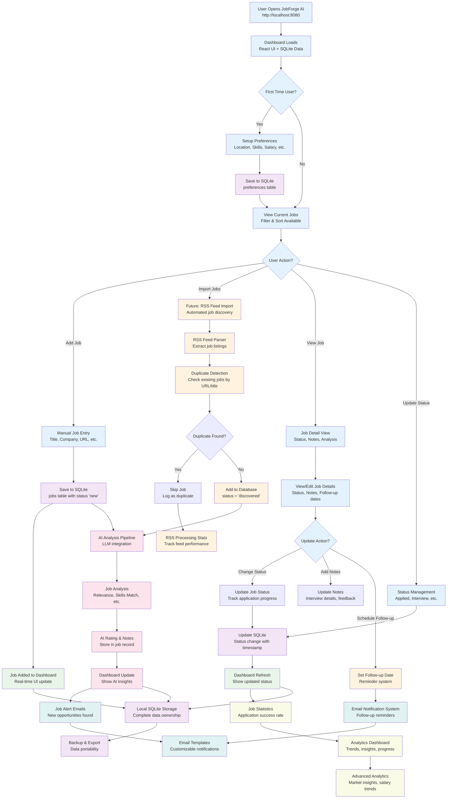
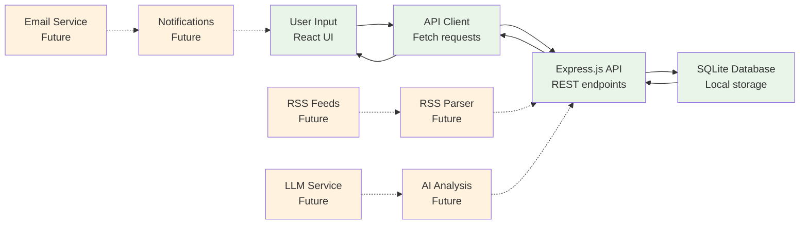

# Job Hunting Journey - Process Flow

## Overview

This document maps the complete job hunting automation journey for JobForge AI. The project originally started as an n8n workflow concept but has evolved into a local-first SQLite + Express.js application. This document shows both the original vision and the current implementation path.

## Original n8n Workflow Concept

The project began with a vision of fully automated job hunting using n8n workflows. Here's the original conceptual flow:

### Original n8n Flow Diagram

```mermaid
flowchart TD
    %% Original n8n Trigger and Initial Setup
    A[Schedule Trigger<br/>Daily at 9:00 AM] --> B[Set Workflow Variables<br/>Initialize counters & config]
    B --> C[Set Job Preferences<br/>Location, remote, travel preferences]
    C --> D[Get RSS Feed URLs<br/>From configuration]

    %% RSS Processing Loop
    D --> E[Loop Over RSS Feeds<br/>For each feed URL]
    E --> F[RSS Feed Trigger<br/>Pull latest items]
    F --> G{Feed Success?}
    G -->|No| H[Log Error<br/>Continue to next feed]
    G -->|Yes| I[Process RSS Items<br/>Extract job data]

    %% Data Processing
    I --> J[Code Node: Clean Data<br/>Remove CDATA, extract GUID]
    J --> K[Code Node: Generate Unique ID<br/>Use GUID or create hash]
    K --> L[Google Sheets: Check Duplicates<br/>Query by uniqueID]

    %% Duplicate Handling
    L --> M{Duplicate Found?}
    M -->|Yes| N[Skip Job<br/>Log as duplicate]
    M -->|No| O[Google Sheets: Add New Job<br/>Insert with status 'new']

    %% AI Processing Pipeline
    O --> P[Code Node: Prepare AI Data<br/>Format job info + preferences for AI]
    P --> Q[HTTP Request: Check Ollama<br/>Test if service available]

    %% Ollama Availability Check
    Q --> R{Ollama Available?}
    R -->|No| S[Fatal Error Node<br/>Stop workflow, send alert]
    R -->|Yes| T[HTTP Request: Ollama API<br/>Initial filtering with Prompt 1]

    %% AI Filtering
    T --> U[Code Node: Parse AI Response<br/>Extract rating & reasoning]
    U --> V{Job Approved?}
    V -->|No| W[Google Sheets: Update Status<br/>Mark as 'filtered_out']
    V -->|Yes| X[Code Node: Prepare Detailed Analysis<br/>Format for advanced AI]

    %% Advanced AI Analysis
    X --> Y[HTTP Request: Advanced AI<br/>Detailed analysis with Prompt 2]
    Y --> Z[Code Node: Parse Detailed Analysis<br/>Extract structured insights]
    Z --> AA[Code Node: Format for Email<br/>Prepare job summary]

    %% Email Preparation
    AA --> BB[Code Node: Batch Jobs<br/>Group approved jobs]
    BB --> CC[Code Node: Generate Email Content<br/>Apply template]
    CC --> DD[Send Email Node<br/>Deliver recommendations]

    %% Status Updates and Logging
    DD --> EE[Google Sheets: Update Status<br/>Mark as 'emailed']
    EE --> FF[Code Node: Update Statistics<br/>Track metrics]
    FF --> GG{More Jobs in Batch?}
    GG -->|Yes| V
    GG -->|No| HH{More Feeds?}

    %% Loop Control
    HH -->|Yes| D
    HH -->|No| II[Code Node: Final Logging<br/>Log completion stats]
    II --> JJ[Workflow Complete<br/>Success]

    %% Error Handling Paths
    H --> HH
    N --> HH
    W --> HH
    S --> KK[Error Handler<br/>Send notification]

    %% Styling
    classDef trigger fill:#e1f5fe
    classDef process fill:#f3e5f5
    classDef decision fill:#fff3e0
    classDef storage fill:#e8f5e8
    classDef error fill:#ffebee
    classDef ai fill:#fce4ec
    classDef email fill:#e0f2f1

    class A,B trigger
    class C,D,E,F,I,J,K,O,P,X,AA,BB,EE,II process
    class G,L,M,Q,R,V,FF,GG,HH decision
    class L,O,EE storage
    class H,S,KK error
    class T,Y ai
    class DD email
```

## Current Implementation Journey

The project has evolved from the automated n8n workflow to a local-first application with manual and semi-automated components. Here's the current journey map:

### Current JobForge AI Flow

## Evolution Comparison

### Key Changes from Original Concept

| Aspect | Original n8n Vision | Current Implementation |
|--------|-------------------|----------------------|
| **Automation Level** | Fully automated daily workflow | Manual job entry with planned automation |
| **Data Storage** | Google Sheets | Local SQLite database |
| **User Interface** | Email notifications only | Full React dashboard |
| **Deployment** | Cloud-based n8n instance | Local-first application |
| **AI Integration** | Ollama + Advanced AI pipeline | Planned LLM integration |
| **RSS Processing** | Core feature | Future enhancement |
| **User Control** | Set-and-forget automation | Interactive job management |

### Benefits of Current Approach

1. **User Control**: Direct interaction with job data and status management
2. **Data Privacy**: Complete local data ownership
3. **Flexibility**: Easy to modify preferences and job details
4. **Performance**: Instant access to local data
5. **Reliability**: No dependency on external services

### Retained Core Concepts

1. **AI-Powered Analysis**: Still planned for job evaluation
2. **RSS Feed Processing**: Future automation feature
3. **Email Notifications**: Planned for alerts and updates
4. **Preference-Based Filtering**: User-defined criteria for job matching
5. **Duplicate Detection**: Prevent processing same jobs multiple times

## Implementation Phases

### Phase 1: Current State ✅
- **Manual Job Management**: Add, edit, track job applications
- **Local SQLite Storage**: Complete data ownership and privacy
- **React Dashboard**: Intuitive job management interface
- **Status Tracking**: Application progress monitoring
- **Preferences System**: User-defined job criteria

### Phase 2: Core Automation (In Progress)
- **Application Logic Flow**: Complete job hunting workflow
- **LLM Integration**: AI-powered job analysis and matching
- **Dashboard Enhancement**: Improved UI with AI insights
- **RSS Feed Integration**: Automated job discovery
- **Email Notification System**: Alerts and updates

### Phase 3: Advanced Features (Future)
- **Advanced Analytics**: Job market insights and trends
- **Machine Learning**: Improve matching accuracy over time
- **Integration APIs**: Connect with job platforms
- **Mobile Support**: Responsive design and PWA capabilities

## User Journey Scenarios

### Scenario 1: Manual Job Hunter (Current)
1. User discovers job opportunity online
2. Adds job details to JobForge AI dashboard
3. Sets status to "interested" or "applied"
4. Tracks application progress through interview stages
5. Updates notes with feedback and next steps
6. Analyzes success patterns over time

### Scenario 2: Semi-Automated Hunter (Near Future)
1. RSS feeds automatically discover new jobs daily
2. AI filters jobs based on user preferences
3. User reviews AI-recommended jobs in dashboard
4. Applies to selected opportunities
5. AI provides application strategy suggestions
6. Email notifications for follow-ups and deadlines

### Scenario 3: Fully Automated Assistant (Long-term Vision)
1. System continuously monitors job market
2. AI analyzes and ranks opportunities
3. Automated application submission for perfect matches
4. AI-generated cover letters and follow-up emails
5. Interview scheduling and preparation assistance
6. Comprehensive analytics and market insights

## Technical Architecture Flow

### Data Flow in Current System

### Component Integration

1. **Frontend (React)**: User interface for job management
2. **API Layer (Express.js)**: Business logic and data access
3. **Database (SQLite)**: Local data persistence
4. **Future Components**:
   - RSS Feed Parser for automated job discovery
   - LLM Integration for AI analysis
   - Email Service for notifications
   - Analytics Engine for insights

## Next Steps

### Immediate Development Focus
1. **Application Logic Flow**: Create seamless job hunting workflow
2. **LLM Integration**: Add AI-powered job analysis
3. **Dashboard Enhancement**: Improve user experience
4. **RSS Feed Integration**: Automate job discovery
5. **Email Notifications**: Keep users informed

### Migration Path from n8n Concept
- **Retain Core Workflow Logic**: Adapt n8n node logic to Express.js functions
- **Replace Google Sheets**: Use SQLite for better performance and privacy
- **Enhance User Experience**: Add interactive dashboard instead of email-only
- **Modular AI Integration**: Implement AI services as pluggable components
- **Flexible Automation**: Allow users to control automation level

---

This journey map shows how JobForge AI has evolved from a fully automated n8n workflow concept to a user-centric local application while maintaining the core vision of AI-powered job hunting assistance. The current implementation provides immediate value while building toward the original automation goals. 