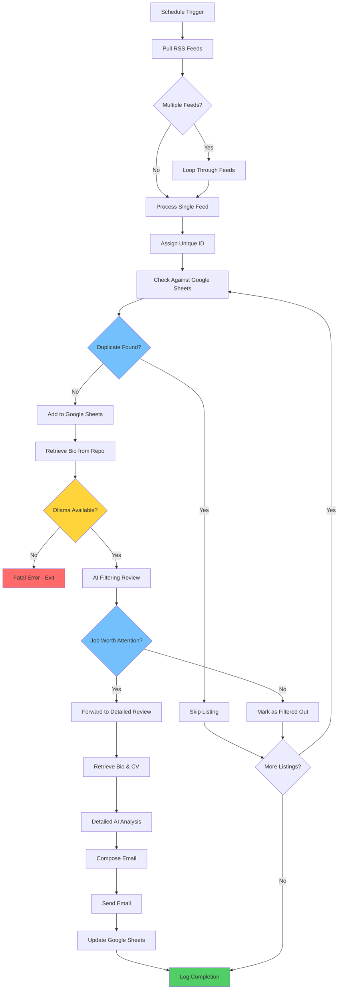

# Job Hunting Automation System - Project Brief


## Project Overview

**Objective**: Automate job hunting process using n8n workflow to monitor RSS feeds, filter opportunities using AI, and deliver curated job recommendations via email.

**Scope**: End-to-end automation from RSS feed monitoring to intelligent job filtering and email delivery.

**Technology Stack**: n8n, Ollama (local LLM), Google Sheets API, RSS feeds, Email service

---

## Executive Summary

This system will automatically process job listings from RSS feeds, apply AI-powered filtering based on candidate profile, and deliver personalized job recommendations. The workflow includes duplicate detection, intelligent filtering, detailed analysis, and automated email delivery.

**Key Benefits**:
- Automated job discovery from multiple sources
- AI-powered relevance filtering
- Personalized job analysis and recommendations
- Reduced manual job hunting time
- Consistent application of filtering criteria

---

## Technical Architecture

### Core Components
1. **RSS Feed Processor** - Monitors multiple job feeds
2. **Duplicate Detection System** - Uses GUID-based identification
3. **AI Filtering Engine** - Two-tier AI analysis (Ollama + Advanced AI)
4. **Data Storage** - Google Sheets for job tracking
5. **Email Delivery System** - Automated job recommendations

### Data Flow
```
RSS Feeds → Unique ID Assignment → Duplicate Check → AI Filtering → Detailed Analysis → Email Delivery
```

---

## Detailed Workflow Specification

### Phase 1: Data Collection & Processing
1. **Schedule Trigger** (Daily execution)
2. **RSS Feed Processing**
   - Loop through configured feed URLs
   - Handle individual feed failures gracefully
   - Apply rate limiting between requests
3. **Unique ID Assignment**
   - Primary: Use RSS GUID when available
   - Fallback: Generate hash from title + company + date
4. **Duplicate Detection**
   - Query Google Sheets by uniqueID
   - Skip previously processed listings

### Phase 2: AI-Powered Filtering
5. **Initial AI Filtering** (Ollama)
   - Evaluate job relevance against candidate profile
   - Rate as: REJECT, MAYBE, or APPROVE
   - Provide brief reasoning and top matches
6. **Detailed AI Analysis** (Advanced AI)
   - Comprehensive job opportunity analysis
   - Technical challenges assessment
   - Career growth potential evaluation
   - Company assessment and red flags

### Phase 3: Delivery & Tracking
7. **Email Composition & Delivery**
   - Format job recommendations
   - Include AI analysis summaries
   - Provide direct links to job listings
8. **Status Tracking**
   - Update Google Sheets with processing status
   - Log completion and statistics

---

## Technical Decisions & Learnings

### RSS Feed Analysis
**Source**: https://rss.app/feeds/_dut10XITtqVqfwp1.xml

**Key Findings**:
- ✅ **GUID Available**: Each job has unique GUID (e.g., `0e57b773e8269d2abff694f9dbcf5839`)
- ✅ **Structured Data**: Clear title, link, description, publication date
- ✅ **Direct Job URLs**: Links go directly to external job listings
- ⚠️ **CDATA Wrapping**: Content wrapped in CDATA sections requiring cleanup

**Processing Strategy**:
```javascript
function processRSSItem(item) {
  const uniqueId = item.guid || generateHash(item.title + item.link + item.pubDate);

  return {
    uniqueId: uniqueId,
    title: item.title.replace(/<!\[CDATA\[|\]\]>/g, ''), // Remove CDATA
    company: extractCompanyFromTitle(item.title),
    location: extractLocationFromDescription(item.description),
    url: item.link,
    description: item.description.replace(/<!\[CDATA\[|\]\]>/g, ''),
    publishedDate: new Date(item.pubDate),
    source: 'rss_feed'
  };
}
```

### Unique Identification Strategy
**Decision**: Use RSS GUID as primary identifier
**Rationale**:
- RSS feeds provide built-in unique identifiers
- Eliminates need for complex hash generation
- Ensures reliable duplicate detection
- Fallback to hash generation if GUID unavailable

### AI Architecture Decisions
**Two-Tier Approach**:
1. **Ollama (Local LLM)** - Initial filtering for cost efficiency
2. **Advanced AI Service** - Detailed analysis for approved jobs

**Rationale**:
- Cost optimization (filter before detailed analysis)
- Local processing for privacy and reliability
- Fatal failure handling for Ollama unavailability

---

## Configuration Requirements

### RSS Feed Configuration
```json
{
  "feeds": [
    "https://rss.app/feeds/_dut10XITtqVqfwp1.xml",
    // Add additional feed URLs
  ],
  "processing": {
    "rateLimit": 1000, // ms between requests
    "timeout": 30000,  // ms for feed requests
    "maxRetries": 3
  }
}
```

### AI Service Configuration
```json
{
  "ollama": {
    "endpoint": "http://localhost:11434",
    "model": "llama3.1:8b",
    "timeout": 60000
  },
  "advancedAI": {
    "service": "openai", // or alternative
    "model": "gpt-4",
    "timeout": 120000
  }
}
```

### Google Sheets Configuration
```json
{
  "spreadsheetId": "your-sheet-id",
  "worksheets": {
    "jobs": "JobListings",
    "status": "ProcessingStatus"
  },
  "columns": {
    "uniqueId": "A",
    "title": "B",
    "company": "C",
    "status": "D",
    "processedDate": "E"
  }
}
```

---

## AI Prompt Specifications

### Prompt 1: Initial Filtering (Ollama)
**Purpose**: Determine job relevance using basic criteria

```markdown
You are a job filtering assistant. Review this job listing against the candidate's profile and determine if it's worth their attention.

CANDIDATE PROFILE:
[Insert bio/CV data here]

JOB LISTING:
Title: {job_title}
Company: {company}
Location: {location}
Description: {job_description}
URL: {job_url}

CRITERIA TO EVALUATE:
- Location compatibility (remote/hybrid/onsite preferences)
- Career level match (junior/mid/senior)
- Technology stack alignment
- Salary expectations (if mentioned)
- Company size/type preference

INSTRUCTIONS:
1. Access the job listing URL to get full details if needed
2. Rate this job as: REJECT, MAYBE, or APPROVE
3. Provide brief reasoning (1-2 sentences)
4. If APPROVE, list the top 3 reasons why it's a good match

OUTPUT FORMAT:
Rating: [REJECT/MAYBE/APPROVE]
Reasoning: [Brief explanation]
Top Matches: [If APPROVE, list 3 key reasons]
```

### Prompt 2: Detailed Analysis (Advanced AI)
**Purpose**: Comprehensive job opportunity analysis

```markdown
You are a senior career advisor. Provide a detailed analysis of this job opportunity for a candidate.

CANDIDATE BACKGROUND:
[Insert detailed bio/CV data here]

JOB DETAILS:
Title: {job_title}
Company: {company}
Location: {location}
Full Description: {complete_job_description}
URL: {job_url}

ANALYSIS REQUIREMENTS:
1. **Why This Job is Worth Reviewing**: Explain the specific opportunities and benefits
2. **Technical Challenges**: Identify the main technical challenges and learning opportunities
3. **Career Growth Potential**: Assess how this role could advance their career
4. **Company Assessment**: Evaluate the company's stability, culture, and reputation
5. **Potential Red Flags**: Note any concerns or areas requiring investigation
6. **Application Strategy**: Suggest how to approach the application process

OUTPUT FORMAT:
## Job Analysis: {job_title} at {company}

### Why Worth Reviewing
[2-3 paragraphs on opportunities and benefits]

### Technical Challenges
[Specific technical challenges and learning opportunities]

### Career Growth
[How this role advances career trajectory]

### Company Assessment
[Company evaluation and culture fit]

### Potential Concerns
[Any red flags or areas needing investigation]

### Application Recommendations
[How to approach applying for this role]
```

---

## Email Template Specification

### Subject Line
```
New Job Opportunities: {count} positions matching your profile
```

### Email Body
```markdown
Hi [Your Name],

I found {count} new job opportunities that match your profile and criteria:

---

**{job_title}** at {company}
📍 {location} | 💰 {salary_range_if_available}
🔗 [View Job]({job_url}) | 🏢 [Company Website]({company_website})

**Why This Role:**
{ai_analysis_summary}

**Key Challenges:**
{technical_challenges_summary}

**Career Growth:**
{career_growth_summary}

---

[Repeat for each job...]

---

**Next Steps:**
- Review each listing in detail
- Check company websites for additional context
- Prepare tailored applications for roles of interest

**Your Profile Summary:**
- Current focus: {your_current_focus}
- Preferred locations: {location_preferences}
- Target salary range: {salary_range}
- Key skills: {top_skills}

Generated on: {timestamp}
Total jobs processed: {total_processed}
Jobs filtered out: {filtered_count}

---
*This email was automatically generated by your job hunting assistant.*
```

---

## Error Handling Strategy

### Critical Failures (Fatal)
- **Ollama Unavailable**: Exit workflow with error status
- **Google Sheets API Failure**: Exit workflow, manual intervention required
- **RSS Feed Inaccessible**: Log error, continue with available feeds

### Non-Critical Failures (Graceful Degradation)
- **Individual Feed Failure**: Skip feed, continue processing others
- **AI Service Timeout**: Mark job for manual review
- **Email Delivery Failure**: Retry with exponential backoff
- **Job URL Inaccessible**: Process with available data only

### Retry Logic
```javascript
const retryConfig = {
  maxRetries: 3,
  backoffMultiplier: 2,
  initialDelay: 1000,
  maxDelay: 30000
};
```

---

## Monitoring & Logging

### Key Metrics to Track
- Total jobs processed per run
- Jobs filtered out vs. approved
- AI processing time per job
- Email delivery success rate
- RSS feed availability
- Error rates by component

### Logging Strategy
```javascript
const logLevels = {
  INFO: 'Flow execution, job processing',
  WARN: 'Non-critical failures, retries',
  ERROR: 'Critical failures, fatal errors',
  DEBUG: 'Detailed processing steps'
};
```

---

## Implementation Timeline

### Phase 1: Foundation (Week 1)
- [ ] Set up n8n environment
- [ ] Configure RSS feed processing
- [ ] Implement unique ID strategy
- [ ] Set up Google Sheets integration

### Phase 2: AI Integration (Week 2)
- [ ] Configure Ollama for initial filtering
- [ ] Implement AI prompt templates
- [ ] Set up advanced AI service
- [ ] Test AI filtering accuracy

### Phase 3: Email & Delivery (Week 3)
- [ ] Implement email template
- [ ] Configure email delivery service
- [ ] Set up status tracking
- [ ] Test end-to-end workflow

### Phase 4: Optimization (Week 4)
- [ ] Implement error handling
- [ ] Add monitoring and logging
- [ ] Performance optimization
- [ ] Production deployment

---

## Risk Assessment

### Technical Risks
| Risk | Probability | Impact | Mitigation |
|------|-------------|--------|------------|
| RSS feed changes | Medium | High | Monitor feed structure, implement fallback parsing |
| AI service downtime | Low | Medium | Implement retry logic, manual review fallback |
| Google Sheets API limits | Low | High | Implement rate limiting, batch operations |
| Email delivery failures | Low | Medium | Retry logic, alternative delivery methods |

### Operational Risks
| Risk | Probability | Impact | Mitigation |
|------|-------------|--------|------------|
| False positive filtering | Medium | Medium | Regular prompt tuning, manual review samples |
| Data privacy concerns | Low | High | Local AI processing, minimal data retention |
| System maintenance | Low | Medium | Automated monitoring, alerting |

---

## Success Criteria

### Functional Requirements
- [ ] Process multiple RSS feeds successfully
- [ ] Detect and skip duplicate job listings
- [ ] Apply AI filtering with >80% accuracy
- [ ] Deliver formatted email recommendations
- [ ] Track job processing status

### Performance Requirements
- [ ] Process 100+ jobs per run within 30 minutes
- [ ] AI filtering response time <60 seconds per job
- [ ] Email delivery within 5 minutes of processing
- [ ] 99% uptime for automated workflow

### Quality Requirements
- [ ] Zero duplicate job recommendations
- [ ] Relevant job filtering (subjective validation)
- [ ] Professional email formatting
- [ ] Comprehensive error logging

---

## Future Enhancements

### Phase 2 Features
- **Multi-language Support**: Process international job feeds
- **Advanced Analytics**: Job market trends and salary analysis
- **Integration APIs**: Connect with job application platforms
- **Mobile Notifications**: Push notifications for urgent opportunities

### Phase 3 Features
- **Machine Learning**: Improve filtering accuracy over time
- **Social Integration**: Share opportunities with network
- **Application Tracking**: Monitor application status
- **Interview Preparation**: AI-powered interview prep resources

---

## Detailed n8n Workflow Implementation

### Node-by-Node Workflow Diagram

```mermaid
flowchart TD
    %% Trigger and Initial Setup
    A[Schedule Trigger<br/>Daily at 9:00 AM] --> B[Set Workflow Variables<br/>Initialize counters & config]
    B --> C[Set Job Preferences<br/>Location, remote, travel preferences]
    C --> D[Get RSS Feed URLs<br/>From configuration]

    %% RSS Processing Loop
    D --> E[Loop Over RSS Feeds<br/>For each feed URL]
    E --> F[RSS Feed Trigger<br/>Pull latest items]
    F --> G{Feed Success?}
    G -->|No| H[Log Error<br/>Continue to next feed]
    G -->|Yes| I[Process RSS Items<br/>Extract job data]

    %% Data Processing
    I --> J[Code Node: Clean Data<br/>Remove CDATA, extract GUID]
    J --> K[Code Node: Generate Unique ID<br/>Use GUID or create hash]
    K --> L[Google Sheets: Check Duplicates<br/>Query by uniqueID]

    %% Duplicate Handling
    L --> M{Duplicate Found?}
    M -->|Yes| N[Skip Job<br/>Log as duplicate]
    M -->|No| O[Google Sheets: Add New Job<br/>Insert with status 'new']

    %% AI Processing Pipeline
    O --> P[Code Node: Prepare AI Data<br/>Format job info + preferences for AI]
    P --> Q[HTTP Request: Check Ollama<br/>Test if service available]

    %% Ollama Availability Check
    Q --> R{Ollama Available?}
    R -->|No| S[Fatal Error Node<br/>Stop workflow, send alert]
    R -->|Yes| T[HTTP Request: Ollama API<br/>Initial filtering with Prompt 1]

    %% AI Filtering
    T --> U[Code Node: Parse AI Response<br/>Extract rating & reasoning]
    U --> V{Job Approved?}
    V -->|No| W[Google Sheets: Update Status<br/>Mark as 'filtered_out']
    V -->|Yes| X[Code Node: Prepare Detailed Analysis<br/>Format for advanced AI]

    %% Advanced AI Analysis
    X --> Y[HTTP Request: Advanced AI<br/>Detailed analysis with Prompt 2]
    Y --> Z[Code Node: Parse Detailed Analysis<br/>Extract structured insights]
    Z --> AA[Code Node: Format for Email<br/>Prepare job summary]

    %% Email Preparation
    AA --> BB[Code Node: Batch Jobs<br/>Group approved jobs]
    BB --> CC[Code Node: Generate Email Content<br/>Apply template]
    CC --> DD[Send Email Node<br/>Deliver recommendations]

    %% Status Updates and Logging
    DD --> EE[Google Sheets: Update Status<br/>Mark as 'emailed']
    EE --> FF[Code Node: Update Statistics<br/>Track metrics]
    FF --> GG{More Jobs in Batch?}
    GG -->|Yes| V
    GG -->|No| HH{More Feeds?}

    %% Loop Control
    HH -->|Yes| D
    HH -->|No| II[Code Node: Final Logging<br/>Log completion stats]
    II --> JJ[Workflow Complete<br/>Success]

    %% Error Handling Paths
    H --> HH
    N --> HH
    W --> HH
    S --> KK[Error Handler<br/>Send notification]

    %% Styling
    classDef trigger fill:#e1f5fe
    classDef process fill:#f3e5f5
    classDef decision fill:#fff3e0
    classDef storage fill:#e8f5e8
    classDef error fill:#ffebee
    classDef ai fill:#fce4ec
    classDef email fill:#e0f2f1

    class A,B trigger
    class C,D,E,F,I,J,K,O,P,X,AA,BB,EE,II process
    class G,L,M,Q,R,V,FF,GG,HH decision
    class L,O,EE storage
    class H,S,KK error
    class T,Y ai
    class DD email
```



### Node Configuration Details

#### 1. Schedule Trigger Node
```json
{
  "triggerTimes": {
    "item": [
      {
        "mode": "everyDay",
        "hour": 9,
        "minute": 0
      }
    ]
  }
}
```

#### 2. Set Workflow Variables Node
```json
{
  "variables": {
    "totalJobsProcessed": 0,
    "jobsApproved": 0,
    "jobsFiltered": 0,
    "startTime": "{{ $now }}",
    "rssFeeds": [
      "https://rss.app/feeds/_dut10XITtqVqfwp1.xml"
    ]
  }
}
```

#### 3. Set Job Preferences Node
```json
{
  "values": {
    "string": [
      {
        "name": "preferredLocations",
        "value": "Belfast, Northern Ireland, UK, Remote"
      },
      {
        "name": "workMode",
        "value": "hybrid,remote,onsite"
      },
      {
        "name": "travelWillingness",
        "value": "limited"
      },
      {
        "name": "salaryRange",
        "value": "40000-80000"
      },
      {
        "name": "careerLevel",
        "value": "senior,mid"
      },
      {
        "name": "techStack",
        "value": "broadcast,media,production,networking,AV,IP"
      },
      {
        "name": "companySize",
        "value": "startup,medium,large"
      }
    ]
  }
}
```

#### 3. RSS Feed Trigger Node
```json
{
  "url": "{{ $json.rssFeedUrl }}",
  "options": {
    "timeout": 30000,
    "headers": {
      "User-Agent": "n8n-job-hunter/1.0"
    }
  }
}
```

#### 4. Code Node: Clean RSS Data
```javascript
// Clean RSS data and extract job information
const items = $input.all();
const cleanedItems = [];

for (const item of items) {
  const cleanedItem = {
    uniqueId: item.guid || generateHash(item.title + item.link + item.pubDate),
    title: item.title.replace(/<!\[CDATA\[|\]\]>/g, ''),
    company: extractCompanyFromTitle(item.title),
    location: extractLocationFromDescription(item.description),
    url: item.link,
    description: item.description.replace(/<!\[CDATA\[|\]\]>/g, ''),
    publishedDate: new Date(item.pubDate),
    source: 'rss_feed'
  };
  cleanedItems.push(cleanedItem);
}

return cleanedItems.map(item => ({ json: item }));
```

#### 5. Code Node: Prepare AI Data (with Preferences)
```javascript
// Prepare job data with candidate preferences for AI analysis
const jobData = $input.first().json;
const preferences = {
  preferredLocations: $('Set Job Preferences').first().json.preferredLocations,
  workMode: $('Set Job Preferences').first().json.workMode,
  travelWillingness: $('Set Job Preferences').first().json.travelWillingness,
  salaryRange: $('Set Job Preferences').first().json.salaryRange,
  careerLevel: $('Set Job Preferences').first().json.careerLevel,
  techStack: $('Set Job Preferences').first().json.techStack,
  companySize: $('Set Job Preferences').first().json.companySize
};

// Create AI prompt with job data and preferences
const aiPrompt = `You are a job filtering assistant. Review this job listing against the candidate's profile and determine if it's worth their attention.

CANDIDATE PREFERENCES:
- Preferred Locations: ${preferences.preferredLocations}
- Work Mode: ${preferences.workMode}
- Travel Willingness: ${preferences.travelWillingness}
- Salary Range: £${preferences.salaryRange}
- Career Level: ${preferences.careerLevel}
- Tech Stack: ${preferences.techStack}
- Company Size: ${preferences.companySize}

JOB LISTING:
Title: ${jobData.title}
Company: ${jobData.company}
Location: ${jobData.location}
Description: ${jobData.description}
URL: ${jobData.url}

CRITERIA TO EVALUATE:
- Location compatibility with preferred locations
- Work mode alignment (remote/hybrid/onsite)
- Travel requirements vs. willingness
- Salary expectations (if mentioned)
- Career level match
- Technology stack alignment
- Company size preference

INSTRUCTIONS:
1. Access the job listing URL to get full details if needed
2. Rate this job as: REJECT, MAYBE, or APPROVE
3. Provide brief reasoning (1-2 sentences)
4. If APPROVE, list the top 3 reasons why it's a good match

OUTPUT FORMAT:
Rating: [REJECT/MAYBE/APPROVE]
Reasoning: [Brief explanation]
Top Matches: [If APPROVE, list 3 key reasons]`;

return [{
  json: {
    ...jobData,
    aiPrompt: aiPrompt,
    preferences: preferences
  }
}];
```

#### 6. Google Sheets: Check Duplicates Node
```json
{
  "operation": "read",
  "sheetName": "JobListings",
  "range": "A:A",
  "options": {
    "filter": {
      "criteria": [
        {
          "column": "A",
          "operator": "equals",
          "value": "{{ $json.uniqueId }}"
        }
      ]
    }
  }
}
```

#### 7. HTTP Request: Ollama API Node
```json
{
  "method": "POST",
  "url": "http://localhost:11434/api/generate",
  "headers": {
    "Content-Type": "application/json"
  },
  "body": {
    "model": "llama3.1:8b",
    "prompt": "{{ $json.aiPrompt }}",
    "stream": false,
    "options": {
      "temperature": 0.7,
      "top_p": 0.9,
      "tools": [
        {
          "name": "fetch_job_details",
          "description": "Fetch full job description from URL"
        },
        {
          "name": "research_company",
          "description": "Get company information and reputation"
        }
      ]
    }
  }
}
```

#### 8. Send Email Node
```json
{
  "toEmail": "{{ $vars.userEmail }}",
  "subject": "New Job Opportunities: {{ $json.jobCount }} positions matching your profile",
  "text": "{{ $json.emailBody }}",
  "html": "{{ $json.emailHtml }}"
}
```

### Job Preferences Configuration

The **Set Job Preferences** node is crucial for personalizing the AI filtering. It defines the candidate's job hunting criteria that will be used by the LLM to evaluate each job listing.

#### Key Preference Categories:

**Location Preferences:**
- `preferredLocations`: Geographic areas to consider (e.g., "Belfast, Northern Ireland, UK, Remote")
- `workMode`: Preferred work arrangements (e.g., "hybrid,remote,onsite")
- `travelWillingness`: Travel requirements acceptance (e.g., "limited", "moderate", "extensive")

**Career Preferences:**
- `salaryRange`: Expected salary range in GBP (e.g., "40000-80000")
- `careerLevel`: Target career stage (e.g., "senior,mid", "junior,mid")
- `techStack`: Relevant technology skills (e.g., "broadcast,media,production,networking,AV,IP")
- `companySize`: Preferred company size (e.g., "startup,medium,large")

#### How Preferences Work with AI:

1. **Dynamic Prompt Generation**: The preferences are injected into the AI prompt, making each evaluation personalized
2. **Structured Evaluation**: The LLM uses these criteria to systematically assess each job
3. **Consistent Filtering**: Ensures all jobs are evaluated against the same criteria
4. **Easy Updates**: Change preferences in one place to update filtering behavior

#### Example Preference Impact:

```javascript
// With these preferences:
preferredLocations: "Belfast, Northern Ireland, UK, Remote"
workMode: "hybrid,remote,onsite"
travelWillingness: "limited"

// The LLM will:
// ✅ APPROVE: Belfast-based hybrid role
// ✅ APPROVE: UK remote position
// ❌ REJECT: London onsite-only role requiring daily commute
// ❌ REJECT: International role requiring 50% travel
```

### LLM Tools & Enhancements

#### Required Tools for Job Analysis

**1. Web Scraping Tool (for Job Details)**
```javascript
// Tool: Fetch job listing details from URL
const webScrapingTool = {
  name: "fetch_job_details",
  description: "Fetch full job description from job listing URL",
  parameters: {
    url: "string - The job listing URL to fetch"
  },
  function: async (url) => {
    // Use HTTP Request node to fetch job details
    // Parse HTML to extract full job description
    // Return structured job data
  }
};
```

**2. Company Research Tool**
```javascript
// Tool: Research company information
const companyResearchTool = {
  name: "research_company",
  description: "Get company information, size, culture, and reputation",
  parameters: {
    companyName: "string - Company name to research"
  },
  function: async (companyName) => {
    // Search company databases, LinkedIn, Glassdoor
    // Return company size, industry, culture info
  }
};
```

**3. Salary Analysis Tool**
```javascript
// Tool: Analyze salary information
const salaryTool = {
  name: "analyze_salary",
  description: "Check if salary is competitive for role and location",
  parameters: {
    role: "string - Job title",
    location: "string - Job location",
    salary: "string - Offered salary"
  },
  function: async (role, location, salary) => {
    // Query salary databases
    // Return market rate comparison
  }
};
```

#### Memory Implementation

**1. Conversation Memory (for Advanced AI)**
```javascript
// Store conversation context for detailed analysis
const conversationMemory = {
  jobHistory: [], // Previously analyzed jobs
  candidateProfile: {}, // Cached bio/CV data
  preferences: {}, // Job preferences
  analysisPatterns: [] // Learning from previous decisions
};
```

**2. Decision Memory (for Consistency)**
```javascript
// Track AI decisions for consistency and learning
const decisionMemory = {
  approvedJobs: [],
  rejectedJobs: [],
  reasoningPatterns: {},
  accuracyMetrics: {}
};
```

#### Output Parsers

**1. Structured Response Parser (Initial Filtering)**
```javascript
// Parse Ollama response into structured format
const initialFilterParser = {
  pattern: /Rating:\s*(REJECT|MAYBE|APPROVE)\s*\nReasoning:\s*(.*?)\s*\nTop Matches:\s*(.*)/s,
  extract: (response) => {
    const match = response.match(this.pattern);
    return {
      rating: match[1],
      reasoning: match[2].trim(),
      topMatches: match[3] ? match[3].split(',').map(m => m.trim()) : []
    };
  }
};
```

**2. Detailed Analysis Parser (Advanced AI)**
```javascript
// Parse detailed analysis into structured sections
const detailedAnalysisParser = {
  sections: [
    'Why Worth Reviewing',
    'Technical Challenges',
    'Career Growth',
    'Company Assessment',
    'Potential Concerns',
    'Application Recommendations'
  ],
  extract: (response) => {
    const sections = {};
    this.sections.forEach(section => {
      const regex = new RegExp(`### ${section}\\s*\\n([\\s\\S]*?)(?=###|$)`, 'i');
      const match = response.match(regex);
      sections[section.toLowerCase().replace(/\s+/g, '_')] = match ? match[1].trim() : '';
    });
    return sections;
  }
};
```

#### Enhanced Node Configurations

**Updated HTTP Request: Ollama API (with Tools)**
```json
{
  "method": "POST",
  "url": "http://localhost:11434/api/generate",
  "headers": {
    "Content-Type": "application/json"
  },
  "body": {
    "model": "llama3.1:8b",
    "prompt": "{{ $json.aiPrompt }}",
    "stream": false,
    "options": {
      "temperature": 0.7,
      "top_p": 0.9,
      "tools": [
        {
          "name": "fetch_job_details",
          "description": "Fetch full job description from URL"
        },
        {
          "name": "research_company",
          "description": "Get company information and reputation"
        }
      ]
    }
  }
}
```

**Code Node: Enhanced Response Parser**
```javascript
// Enhanced parsing with error handling and validation
const response = $input.first().json.response;

// Try structured parsing first
let parsedResponse;
try {
  parsedResponse = initialFilterParser.extract(response);
} catch (error) {
  // Fallback to simple parsing
  parsedResponse = {
    rating: response.includes('APPROVE') ? 'APPROVE' :
            response.includes('MAYBE') ? 'MAYBE' : 'REJECT',
    reasoning: response.substring(0, 200) + '...',
    topMatches: []
  };
}

// Validate rating
if (!['REJECT', 'MAYBE', 'APPROVE'].includes(parsedResponse.rating)) {
  parsedResponse.rating = 'MAYBE'; // Default to manual review
}

// Store in memory for consistency
const memory = $('Set Workflow Variables').first().json.memory || {};
memory.recentDecisions = memory.recentDecisions || [];
memory.recentDecisions.push({
  jobId: $input.first().json.uniqueId,
  rating: parsedResponse.rating,
  timestamp: new Date().toISOString()
});

return [{
  json: {
    ...$input.first().json,
    parsedResponse: parsedResponse,
    memory: memory
  }
}];
```

#### Memory Management Node

**Code Node: Memory Management**
```javascript
// Manage conversation and decision memory
const currentMemory = $('Set Workflow Variables').first().json.memory || {};
const jobData = $input.first().json;

// Update conversation memory
currentMemory.jobHistory = currentMemory.jobHistory || [];
currentMemory.jobHistory.push({
  id: jobData.uniqueId,
  title: jobData.title,
  company: jobData.company,
  timestamp: new Date().toISOString()
});

// Keep only last 100 jobs in memory
if (currentMemory.jobHistory.length > 100) {
  currentMemory.jobHistory = currentMemory.jobHistory.slice(-100);
}

// Update decision patterns
currentMemory.decisionPatterns = currentMemory.decisionPatterns || {};
const company = jobData.company.toLowerCase();
if (!currentMemory.decisionPatterns[company]) {
  currentMemory.decisionPatterns[company] = {
    approvals: 0,
    rejections: 0,
    lastDecision: null
  };
}

return [{
  json: {
    ...jobData,
    memory: currentMemory,
    context: `Previous decisions for ${jobData.company}: ${currentMemory.decisionPatterns[company].approvals} approved, ${currentMemory.decisionPatterns[company].rejections} rejected`
  }
}];
```

#### Benefits of These Enhancements

**1. Tools Benefits:**
- **Web Scraping**: Get full job details when RSS description is limited
- **Company Research**: Better company assessment and culture fit
- **Salary Analysis**: Ensure competitive compensation evaluation

**2. Memory Benefits:**
- **Consistency**: Avoid contradicting previous decisions
- **Learning**: Improve accuracy over time
- **Context**: Better understanding of candidate preferences

**3. Output Parser Benefits:**
- **Reliability**: Structured, validated responses
- **Error Handling**: Graceful fallbacks for malformed AI responses
- **Consistency**: Standardized output format

### Data Flow Between Nodes

#### RSS Processing Flow
```
RSS Feed Trigger → Code Node (Clean) → Code Node (Unique ID) → Google Sheets (Check) → Decision Node
```

#### AI Processing Flow
```
Code Node (Prepare) → HTTP Request (Ollama) → Code Node (Parse) → Decision Node → HTTP Request (Advanced AI)
```

#### Email Delivery Flow
```
Code Node (Format) → Code Node (Batch) → Code Node (Template) → Send Email → Google Sheets (Update)
```

### Error Handling Implementation

#### Critical Error Handling
- **Ollama Unavailable**: HTTP Request fails → Error Trigger → Stop Workflow
- **Google Sheets API Error**: Retry with exponential backoff → Manual intervention if persistent
- **RSS Feed Error**: Log error → Continue with remaining feeds

#### Graceful Degradation
- **Individual Job Processing Error**: Skip job → Log error → Continue with next job
- **AI Service Timeout**: Mark job for manual review → Continue processing
- **Email Delivery Failure**: Retry up to 3 times → Log failure for manual review

### Performance Optimizations

#### Batch Processing
- Process multiple RSS feeds in parallel
- Batch Google Sheets operations
- Group approved jobs for single email delivery

#### Rate Limiting
- 1-second delay between RSS feed requests
- 2-second delay between AI API calls
- Respect Google Sheets API quotas

#### Caching Strategy
- Cache bio/CV data for entire workflow run
- Cache RSS feed data to avoid reprocessing
- Store AI responses for debugging

---

## Flow Diagram



---

## Appendix

### RSS Feed Structure
```xml
<rss version="2.0">
  <channel>
    <title><![CDATA[Jobbing]]></title>
    <link>https://rss.app</link>
    <description><![CDATA[Jobbing]]></title>
    <item>
      <title><![CDATA[Web Content Manager]]></title>
      <link>https://www.nijobfinder.co.uk/job/2008169/web-content-manager/0e57b773e8269d2abff694f9dbcf5839</link>
      <guid>0e57b773e8269d2abff694f9dbcf5839</guid>
      <pubDate>Thu, 17 Jul 2025 11:35:00 GMT</pubDate>
      <description><![CDATA[Full job description...]]></description>
    </item>
  </channel>
</rss>
```

### Implementation Notes
- **Use GUID as primary unique identifier** - already provided and unique
- **Clean CDATA content** - remove CDATA wrappers from text fields
- **Extract metadata** - parse title/description for company, location, salary info
- **Handle encoding** - ensure proper UTF-8 handling for special characters
- **Rate limiting** - add delays between processing multiple feeds
